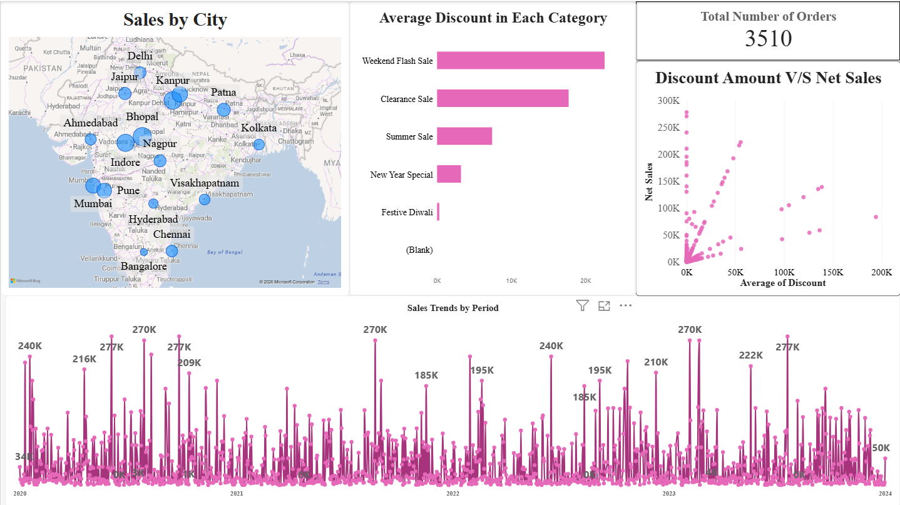
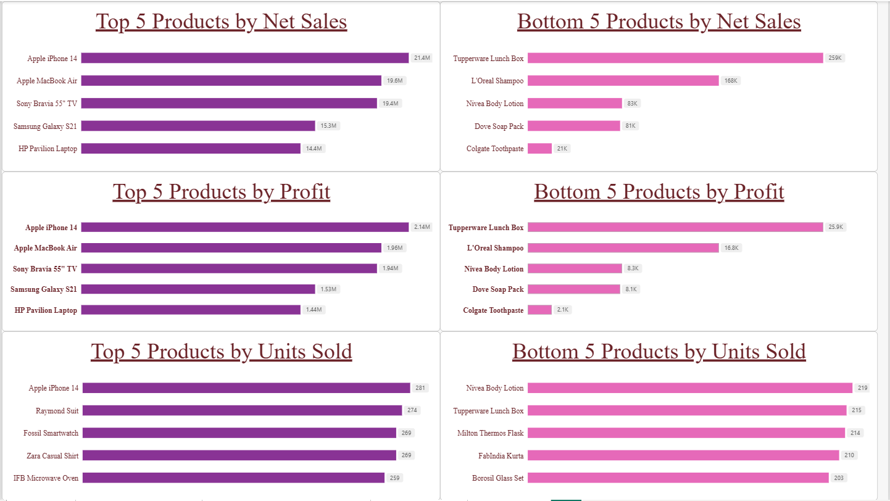

# Sales Performance Dashboard (Power BI)

An interactive Power BI dashboard that analyses **3,510 orders, ₹122M in sales, ₹12.2M in profit and ~7.1K units sold** across 2020-2023. It covers product performance, sales by city, promotion and discount behaviour, and a side-by-side comparison of any two time periods.

**Demo video:** [Watch the walkthrough](https://youtu.be/__PfHLwLwPA)

---

## Business questions

1. Which products drive the most sales, profit and units, and which drive the least?
2. Where in India are sales concentrated?
3. How do sales change over time, and when are the peaks?
4. How do promotions and discounts relate to order value?
5. How does one time period compare with another on sales, profit and quantity?

## Dashboard pages

### 1. Overview: cities, discounts, trend
Sales by city (map), average discount by promotion, total orders, discount amount vs net sales, and daily sales trend from 2020 to 2023.


### 2. Product rankings
Top 5 and bottom 5 products by net sales, profit and units sold.



### 3. Period comparison
Two independent date filters drive side-by-side bars for total sales, profit and quantity sold, so any two windows can be compared.

, Apple MacBook Air (₹19.6M), Sony Bravia 55" TV (₹19.4M), Samsung Galaxy S21 (₹15.3M) and HP Pavilion Laptop (₹14.4M).
- **Revenue ranking is mostly a price story, not a demand story.** Units sold per product sit in a narrow band, from 203 to 281, yet net sales range from ₹21K (Colgate Toothpaste) to ₹21.4M (iPhone 14). iPhone 14 is also the top seller by units (281).
- **The bottom of the revenue table is low-priced household and personal-care items:** Colgate Toothpaste (₹21K), Dove Soap Pack (₹81K), Nivea Body Lotion (₹83K), L'Oreal Shampoo (₹168K) and Tupperware Lunch Box (₹259K).
- **Discount depth varies a lot by promotion.** Weekend Flash Sale and Clearance Sale have the highest average discount amounts, and Festive Diwali has the lowest.
- **The largest orders (up to roughly ₹278K) carried no discount.** The discount vs net sales chart shows the biggest orders sitting at zero discount.
- **Period comparison example:** 18 May 2020 to 4 Sep 2021 recorded ₹39M sales, ₹3.9M profit and 2,226 units. 11 Apr 2023 to the end of the data recorded ₹24M, ₹2.4M and 1,424 units. The second window is shorter (about 9 months vs about 15), so per month the two are close (roughly ₹2.5M vs ₹2.8M in sales). Compare windows of equal length for a fair read.

## Data notes

- The dataset is **synthetic / practice data**, so patterns reflect how it was generated rather than a real business.
- **Profit is modelled as a flat 10% of net sales**, so profit rankings mirror sales rankings by construction.
- Promotion IDs (PR001 to PR005) were mapped to readable promotion names (Weekend Flash Sale, Clearance Sale, Summer Sale, New Year Special, Festive Diwali).
- Prices are in INR.

## Tools and techniques

- Power BI Desktop
- Data modelling across orders, customers, products, promotions and cities
- DAX measures, including separate date contexts for the period comparison
- Slicers and interactive filters, map visual, ranked bar charts, scatter plot, line chart

## How to explore

1. Download `power bi project.pbip` from this repo.
2. Open it in Power BI Desktop (free).
3. Use the slicers and the two date filters to explore.

## Repo structure

```
├── README.md
├── power bi project.pbip
└── Images/
    ├── 01-overview.png
    ├── 02-product-rankings.png
    ├── 03-period-comparison.png
    └── 04-order-table.png
```

## About

Hi, this is Ranit Banerjee, a student with a mathematics background who is switching to the world of datas. This is my first Power BI project. Any feedback is welcome.
